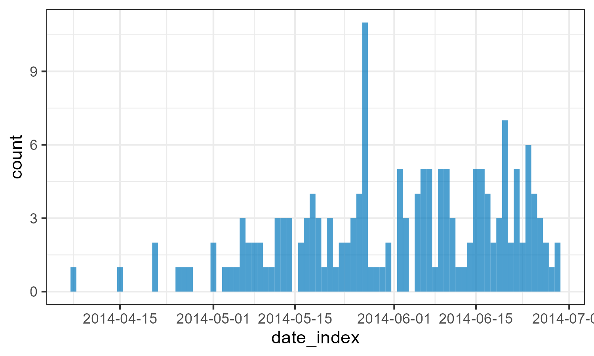

```{r, include = FALSE}
knitr::opts_chunk$set(collapse = TRUE,
                      comment  = "#>")
```


```{r}
library(tidyverse)
```

```{r}
here::here()
```


my text



```{r}
knitr::include_graphics(here::here("figures/02-plot_incidence.png"))
```

```{r,error=TRUE}
knitr::include_graphics(here::here("../figures/02-plot_incidence.png"))
```

```{r,error=TRUE}

```

```{r}
read_rds(here::here("outputs/03-estimate_cfr.rds"))
```


